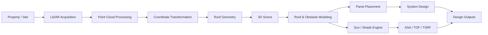
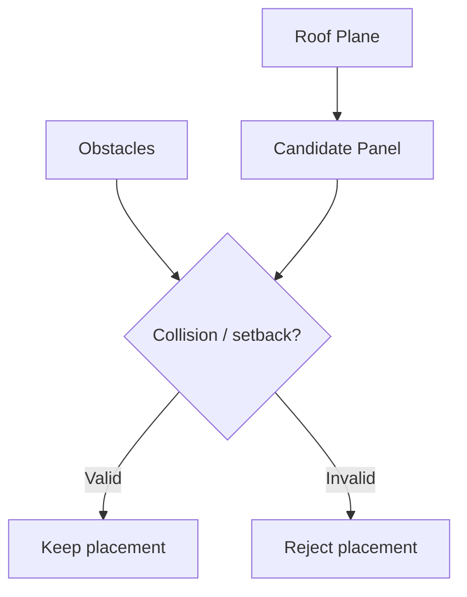
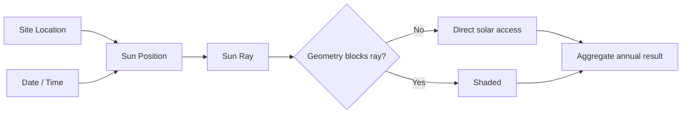

# SightFlight Engineering

> Engineering case study of a LiDAR-powered 3D solar rooftop design and shading analysis platform.

**Live product:** [sightflight.io](https://sightflight.io/)

SightFlight is a solar design platform built around a difficult engineering problem: turning geospatial elevation data into an interactive rooftop environment where solar professionals can model roofs, place panels, account for obstructions, and reason about solar access.

I led development across the 3D, geospatial, solar-analysis, and application layers. This repository documents the engineering behind that work without publishing proprietary application code or customer data.

---

## The problem

A rooftop solar designer needs more than a 3D model.

The system has to answer questions such as:

- What is the actual geometry and orientation of each roof plane?
- Which parts of the roof are usable?
- Where are obstructions and setbacks?
- How many modules can be placed without invalid overlaps?
- How much solar access does each part of the roof receive?
- How does shading change throughout the year?
- How can geospatial measurements remain accurate while the browser renders an interactive scene?

SightFlight brings these problems into a single design workflow.

## System overview



The important architectural decision is to keep **geospatial truth**, **solar calculations**, and **browser rendering** conceptually separate. The browser is a visualization and design environment; it should not become the source of truth for geographic calculations.

## LiDAR & geospatial pipeline

The platform works with elevation/point-cloud data to reconstruct rooftop geometry.

A simplified pipeline looks like this:

```text
Site coordinates
      ↓
LiDAR / elevation source
      ↓
Point-cloud extraction
      ↓
Noise / relevance filtering
      ↓
Coordinate transformation
      ↓
Roof-plane segmentation
      ↓
Local 3D coordinate system
      ↓
Interactive roof model
```

### Coordinate systems

One subtle challenge in geospatial 3D applications is that geographic coordinates and rendering coordinates solve different problems.

The processing pipeline works with projected coordinate systems such as:

- **EPSG:26918 — NAD83 / UTM zone 18N**
- **EPSG:26919 — NAD83 / UTM zone 19N**
- **EPSG:3857 — Web Mercator**, where appropriate for web-map interoperability

Projected coordinates provide meaningful real-world distances, while the Three.js scene works best around a small local origin.

A typical transformation is therefore:

```text
Geographic / projected coordinates
              ↓
      choose site origin
              ↓
 subtract origin / normalize axes
              ↓
       local scene coordinates
```

This avoids feeding very large coordinate values directly into the renderer and keeps interaction and geometry numerically manageable.

## Roof modeling

The roof model is represented as geometric surfaces rather than a decorative mesh.

Each usable roof section can carry engineering properties such as:

```ts
type RoofPlane = {
  polygon: Point3D[];
  azimuth: number;
  tilt: number;
  area: number;
  normal: Vector3;
};
```

Conceptually, the processing stage needs to identify planar regions from a noisy point cloud, determine their orientation, establish boundaries, and convert them into geometry suitable for downstream solar calculations.

That distinction matters: **a visually convincing roof is not necessarily an analytically correct roof.**

## Obstructions

Real roofs contain chimneys, vents, HVAC equipment, dormers, parapets, and other structures.

SightFlight models these objects because they affect both:

1. **layout feasibility**, and
2. **solar access**.



Obstacle geometry also participates in shading calculations, so layout and irradiance analysis operate on the same physical scene.

## Automated panel placement

Panel placement is a constrained geometry problem rather than simply filling a rectangle.

The placement engine has to account for:

- module dimensions
- portrait / landscape orientation
- roof boundaries
- spacing
- setbacks
- obstacles
- invalid intersections
- roof-plane orientation

A simplified conceptual algorithm is:

```python
for roof_plane in usable_roofs:
    grid = build_candidate_grid(roof_plane)

    for candidate in grid:
        if not inside_roof(candidate):
            continue

        if violates_setback(candidate):
            continue

        if intersects_obstacle(candidate):
            continue

        place_panel(candidate)
```

Production behavior is more involved, but this captures the central idea: generate candidates in roof-local coordinates and reject geometrically invalid placements.

## Solar position & annual simulation

Shading cannot be represented by a single shadow snapshot.

The sun's position varies with:

- latitude and longitude
- date
- time
- season

SightFlight evaluates the rooftop scene across time to determine whether relevant roof or module points have direct access to the sun.



At a high level, a sample point can be evaluated by casting toward the calculated sun direction and checking whether roof geometry or an obstruction intersects that path.

Repeating the process over representative timestamps produces an annual solar-access model rather than a purely visual shadow effect.

## ASA, TOF & TSRF

The platform uses solar metrics including **Annual Solar Access (ASA)**, **Tilt and Orientation Factor (TOF)**, and **Total Solar Resource Fraction (TSRF)**.

Conceptually:

```text
ASA  → effect of shading
TOF  → effect of tilt and orientation
TSRF → combined available solar resource
```

A commonly useful relationship is:

```text
TSRF ≈ ASA × TOF
```

when ASA and TOF are represented as fractions.

These metrics let the system move from *"this part of the roof looks sunny"* to a quantitative representation of solar suitability.

## 3D application layer

The interactive design environment uses **Three.js / React Three Fiber**.

The 3D layer has to support more than rendering:

- roof interaction
- object selection
- panel manipulation
- camera navigation
- geometry updates
- obstacle editing
- solar visualization
- design-state synchronization

A major architectural concern is avoiding unnecessary React state updates for high-frequency 3D operations. Rendering state, persistent design state, and analytical state should have clearly defined boundaries.

## Technology

| Area | Technologies / Concepts |
| --- | --- |
| Web application | React, TypeScript |
| 3D | Three.js, React Three Fiber |
| Geospatial | LiDAR, PDAL, laspy, pyproj |
| Coordinate systems | UTM / NAD83, Web Mercator, local scene coordinates |
| Geometry | polygons, planes, vectors, intersections |
| Solar analysis | sun-position simulation, ray intersection, annual aggregation |
| Backend processing | Python-based geospatial workflows |
| Infrastructure | production web/cloud deployment |

## Engineering challenges

### Precision vs. browser rendering

Geospatial systems can operate on large projected coordinate values. Interactive 3D engines generally behave better near the origin.

The solution is to preserve authoritative projected coordinates in the data/analysis layer while deriving a local coordinate space for visualization.

### Analytical geometry vs. visual geometry

It is tempting to treat the rendered mesh as the data model. That quickly becomes problematic when calculations depend on accurate boundaries, normals, azimuth, tilt, and physical dimensions.

SightFlight keeps the engineering representation explicit and lets the visual scene derive from it.

### Performance of shading analysis

Annual shading can become computationally expensive:

```text
samples × timestamps × intersection tests
```

This makes sampling strategy, spatial filtering, caching, batching, and the division of work between frontend/backend important engineering decisions.

### Keeping design state consistent

Moving a panel or changing an obstruction can affect layout validity, 3D visualization, and solar results.

The application therefore needs explicit ownership of state and predictable invalidation/recalculation rather than allowing independent UI components to become competing sources of truth.

## What I worked on

My work on SightFlight included engineering across:

- LiDAR-based rooftop workflows
- 3D roof and obstacle modeling
- automated solar-panel placement
- coordinate-system handling
- annual sun/shading simulation
- ASA / TOF / TSRF analysis
- interactive Three.js design workflows
- integration between frontend visualization and analytical processing
- production application architecture

## Why this repository exists

The production SightFlight codebase is not published here.

This repository exists to document the engineering problems, architectural decisions, and technical systems behind the product while respecting proprietary code, customer information, and implementation details that should remain private.

---

If you're interested in the product itself, visit **[sightflight.io](https://sightflight.io/)**.
