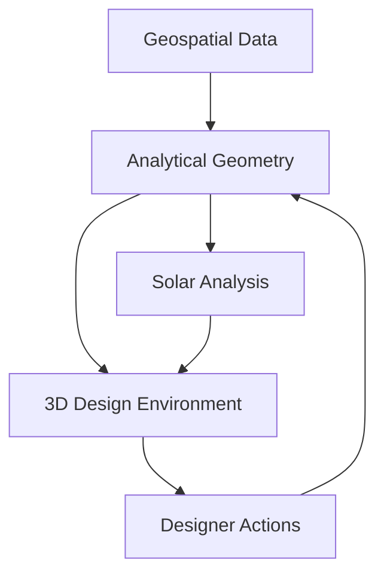

# Architecture Notes

This document expands on the system boundaries described in the main case study.

## Design principle

SightFlight separates four concerns:

1. **Geospatial data** — authoritative coordinates and elevation data.
2. **Analytical geometry** — roofs, obstacles, modules, vectors, dimensions and physical relationships.
3. **Solar analysis** — time-dependent sun position, visibility and aggregated solar metrics.
4. **Interactive presentation** — the browser-based 3D design experience.



Keeping these layers distinct prevents rendering-specific decisions from silently changing engineering calculations.

## Coordinate boundary

A site can retain projected coordinates for analytical operations while exposing local coordinates to the renderer.

```text
projected_point = (E, N, Z)
site_origin     = (E0, N0, Z0)

local_x = E - E0
local_y = Z - Z0
local_z = -(N - N0)
```

The exact axis convention is application-specific. The important property is that conversion is explicit and reversible.

## Solar-analysis boundary

Solar results should be derived data.

When geometry, site information, or relevant analysis settings change, dependent solar results become stale and should be recomputed or invalidated.

This makes the dependency graph conceptually:

```text
site + geometry + time model
             ↓
       solar analysis
             ↓
      derived metrics
             ↓
 visualization / reporting
```

## Performance considerations

Potential optimization strategies for large analyses include:

- reducing unnecessary sample points
- filtering potential occluders spatially
- batching timestamps
- caching invariant geometry
- moving expensive processing away from UI-critical execution
- invalidating only results affected by a design change

The appropriate strategy depends on the required analytical resolution and interaction latency.
